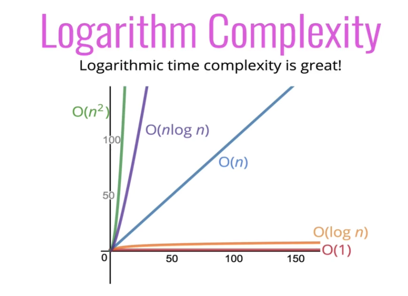

# Big O Notation and Logarithmic Expressions

- To analyze the performance of an algorithm, we use Big O Notations
- Big O Notation can give us a high level understanding of the time or space complexity of an algorithm
- Big O Notation doesn't care about precision, only about general trends (linear? quadratic? constant?)
- The time or space complexity (as measured by Big O) depends only on the algorithm, not hardware used to run the algorithm

# Logarithms

## Why use Logarithmic Expressions

- They are used in searching algorithms that have logarithmic time complexity
- Efficient Sorting Algorithms
- Recursion sometimes involves logarithmic space complexity

### Logarithmic Equations

```
[()] === subscript
log[(base 2)](value) = exponent
log[(2)](8) = 3 -> 2 ^ 3=8
log[(2)](value) = exponent -> 2 ^ exponent = value
Omit the 2
log === log[(2)]
```

> The logarithm of a number roughly measures the number of times you can divide that number by 2 before you get a value that's less than or equal to one

---

# Logarithm Examples

### O of log n is better than O of n by an order of magnitude

```
8 / 2 = 4
4 / 2 = 2
2 / 2 = 1

log(8) = 3

25 / 2 = 12.5 ↲
12.5 / 2 = 6.25 ↲
6.25 / 2 = 3.125 ↲
3.125 / 2 = 1.5625 ↲
1.5625 / 2 = 0.78125 ↲
0.78125

<!-- true -->
log(25) = 4.64

<!-- rounded -->
log(25) = 5

log(startingNumber) = number of times divided by 2 before getting 1 or less
```

# Comparing Time Complexities

> This image shows why logarithmic expressions are ideal when appropriate
> 
